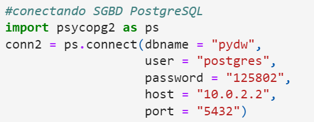

# Data Warehouse

> Data Warehouse em formato de estrela, em desenvolvimento.

### OBJETIVOS GERAIS

O programa deve ser capaz de:

1. Armazenar informações refrentes a: funcionarios, financeiro, mercadoria, fornecedor, rendimento mensal e anual.
2. Cruzar todas estas informações ditas anteriormente, e retornar o lucro e despensas mensais.
3. Essa modelagem dimensional deve ser capaz de, prever situações futuras, auxiliando a tomadas de decisões.

Ilustração do que deve ser, no SQL Power Architect:


## 💻 Pré-requisitos

Antes de começar, verifique se você atendeu aos seguintes requisitos:

- Você instalou a versão mais recente de `Python 3.9 ou superior`, assim como, o banco de dados sugerido: <a href= "https://www.postgresql.org/" > PostgreSQL </a>
  
- Foi utilizado a `IDE`: do `VScode` para execução e conexão ao SGBD PostgreSQL, mas o `Jupiter Notebook`, ou qualquer outro serve.
  
- Você ter uma máquina `Windows / Linux / Mac`.


> [!NOTE]
> Observe que o host é: `"10.0.2.2"`.
> A conexão presente neste código, via `psycopg2` foi gerado através de uma maquina virtual `Ubuntu`, logo deverá ser substituido pelo o seu `localhost`.


=======
[^1]: A conexão presente neste código, via `psycopg2` foi gerado através de uma maquina virtual `Ubuntu`, logo deverá ser trocado os dados, pelo o seu `localhost`.


## 🚀 Instalando o Data Warehouse

Para clonar o código do Data Warehouse, no Linux / macOS / Windows, basta abrir o terminal e colar o seguinte comando:

```
git clone https://github.com/DebbieMatt/Data-Warehouse.git
```

## 📫 Contribuindo para a manutenção

Para contribuir com projeto final e nos auxiliar a continuar desenvolvendo melhor, aprimorando e torna-lo mais eficientes, siga estas etapas:

1. Bifurque este repositório.
2. Crie um branch: `git checkout -b <nome_branch>`.
3. Faça suas alterações e confirme-as: `git commit -m '<mensagem_commit>'`
4. Envie para o branch original: `git push origin <nome_do_projeto> / <local>`
5. Crie a solicitação de pull.

Como alternativa, consulte a documentação do GitHub em [como criar uma solicitação pull](https://help.github.com/en/github/collaborating-with-issues-and-pull-requests/creating-a-pull-request).

## 🤝 Criador

Apresento o(s) (co)criadores deste projeto:

<table>
  <tr>
    <td align="center">
      <a href="https://github.com/DebbieMatt" title="Colaboradora">
        <br>
        <sub>
          <b>Débora Mateus</b>
        </sub>
      </a>
    </td>
    
  </tr>
</table>

## 😄 Seja um dos contribuidores

Quer fazer parte desse projeto? Clique [AQUI](CONTRIBUTING.md) e leia como contribuir.

## 📝 Licença

Esse projeto está sob licença. Veja o arquivo [LICENÇA](LICENSE.md) para mais detalhes.
